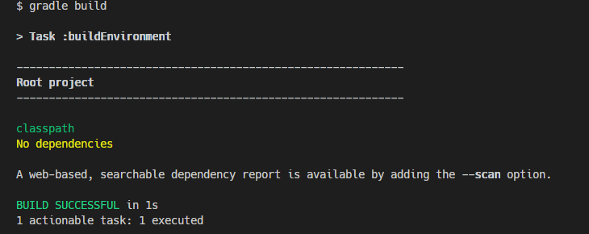

# What's Gradle?

Few hours before now, I did not have a full understanding of what Gradle was. All I knew was that it was a **build tool**. Questions arose!. What is it building really? But I finally got the hang of it.

The term **Building** entails a lot of processes executed in sequence, processes which include: _Generating source files, compiling source and test sources, converting files into executables and packaging them to match the target environments (ear, war, jar)_. After understanding this, I could relate it to my experience in android development and how gradle helps manage my java/kt sources, manage external dependencies and compile them together, run unit tests and among others.

## Okay, now I understand what Gradle does.

Using Gradle, we have something called **tasks**. Tasks are executable set of statement that are supposed to do something. They are like functions/procedures in regular programming. Gradle comes with a number of tasks like _build, clean, assemble, tasks, check, test_ and among others. All these tasks have a particular function that is carried out. These tasks can be written using two DSLs (domain specific languages) which allow developers to write tasks in whatever language they want.

**Defining a Task**

```
    task 'hello' {
        doLast {
            println 'hello gradle!'
        }
    }
```

Create a file called build.gradle. Declaring tasks requires naming the task, in this case 'hello', in the curly braces for the task, we can declare different lifecycle methods whose contents are executed at different points in a task's lifecycle. Examples are doFirst and doLast. Using doLast here, we print out 'hello gradle'. Hurray!, we just created our first gradle script.

## Running Our Task

`gradle build`

Navigate to the folder that contains our _build.gradle_ file and run this command, and see the magic happen!


