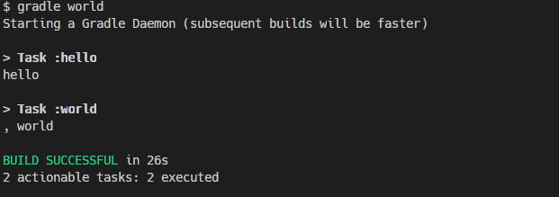

### Introduction to Build Files

- A Build can consist of many projects
- A Project can consist of many tasks

_A build needs a 'build' file, and this can be a groovy **build.gradle** file, or a Kotlin-based **build.gradle.kts** file. Every project needs a build file, this contains tasks to be run in the project's build. A project could also make use of a **settings** file, and this can contain version numbers and a lot more._

### Build Phases

_During a build, it's a process, and it's made up of three phases namely:_

- Initialization Phase: This is the starting point of every build. It initializes the parameters required for a specific task or project.
- Configuration Phase: In this phase, the tasks are recorded for every build and stored to be executed
- Execution Phase: In this phase, the tasks are actually executed.

In a task, we have _doFirst_ and _doLast_. The contents of the _doFirst_ closure is run first, and the contents of the _doLast_ is run last.

### Task Dependecies

_Tasks could depend on other tasks, If a **task a** depends on **task b**, it means **task b** has to run first before **task a** can run. In our task block using the `dependsOn` keyword allows us specify the task that the parent task is dependent on. this signifies to the current task to run the task it depends on before it's contents are run. Take a look!_

```
    task hello {
        doLast {
            println 'hello'
        }
    }

    task world {

        dependsOn hello // run hello before you run this task

        doLast {
            println ', world'
        }
    }
```

Run `gradle world` and the task hello runs before world, and we get this result.



## Adding Plugins

_We can add plugins using their fully qualified names, we use the `id` and `version` keywords to specify the name and the version of the plugin to be applied. An example can be seen below.

```
    plugins {
        id 'org.flywaydb.flyway' version '6.3.2'
    }
```